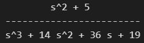
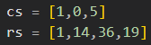

# Diseño de controladores haciendo uso del lugar geométrico

### Introducción
Este programa ha sido diseñado para facilitar el proceso de diseño de controladores al proporcionar herramientas de análisis y visualización de sistemas de control.Podrás ingresar una función de transferencia especificando sus parámetros y seleccionando un controlador P, I, PD, PI y PID. A partir de esta información, el programa te brindará una serie de resultados y gráficos que te ayudarán a comprender y optimizar el comportamiento de tu sistema de control.
Las características principales de este programa incluyen:
- Obtención de la respuesta del sistema: Podrás visualizar la respuesta del sistema sin ningún controlador aplicado, lo que te permitirá comprender su comportamiento inicial.
- Lugar geométrico de la raíz: El programa generará el lugar geométrico de la raíz correspondiente a la función de transferencia antes y despues del controlador
- Diagramas de polos y ceros: Podrás visualizar gráficamente los polos y ceros de la función de transferencia, del controlador y del sistema controlado.
- Cálculo de polos dominantes: El programa calculará automáticamente los polos dominantes del sistema, lo que te permitirá identificar los principales modos de respuesta del sistema.
- Cálculo de ángulos de polos y ceros respecto a los polos dominantes: Obtendrás información sobre los ángulos de los polos y ceros en relación con los polos dominantes.
- Cálculo de constantes del controlador: El programa calculará las constantes del controlador, como ganancia proporcional (Kp), ganancia integral (ti) y ganancia derivativa (td), según la configuración seleccionada.
- Respuesta del sistema con el controlador incluido: Finalmente, podrás visualizar la respuesta del sistema una vez que el controlador haya sido aplicado, lo que te permitirá evaluar y ajustar su desempeño.
Este programa está diseñado para ser intuitivo y de fácil uso, brindar una herramienta eficiente para el diseño y la optimización de controladores. 

### Librerías necesarias:
Para utilizar este programa se necesitan las siguientes librerías de Python:
- Control: Esta librería proporciona funcionalidades para el análisis y diseño de sistemas de control. Puedes instalarla utilizando el siguiente comando:
    'pip install control'

- NumPy: Es una librería fundamental para el cálculo numérico en Python. Proporciona soporte para operaciones matemáticas avanzadas y manipulación de matrices. Puedes instalarla utilizando el siguiente comando:
    'pip install numpy'

- Matplotlib: Esta librería es ampliamente utilizada para la visualización de datos en Python. Te permitirá generar gráficos y diagramas para analizar los resultados del sistema de control. Puedes instalarla utilizando el siguiente comando:
    'pip install matplotlib'

Asegúrate de tener estas librerías instaladas en tu entorno de Python antes de ejecutar el programa. Puedes verificar su instalación importándolas en tu código y comprobando si hay errores.

### Uso básico
Para usar este programa sólo se debe de modificar la primera celda con los siguientes datos:
- Función de transferencia, esta se tiene que ingresar en mediante el polinomia ya desarrollado tanto en el nominador como en el denominador. Ejemplo si tu función de transferencia es: , entonces tu entrada tiene que ser de la siguiente manera: .
- Máximo sobre pico expresado en porcentaje. Únicamente el valor numérico.
- El tiempo de establecimiento expresado en segundos. Únicamente el valor numérico.
- El controlador que se quiere implementar puede ser un controlador P, I, PD, PI o PID. Se tiene que escribir el nombre del controlador en mayusculas y dentro de los parentesis. 
Una vez que se han llenado estos valores es necesario únicamente hacer click en "Run All" para ejecutar todas las celdas y el programa se encargará de hacer los calculos necesarios mostrando graficas para su mejor entendimiento.

### Autor 
Emmanuel Torres Sirangua